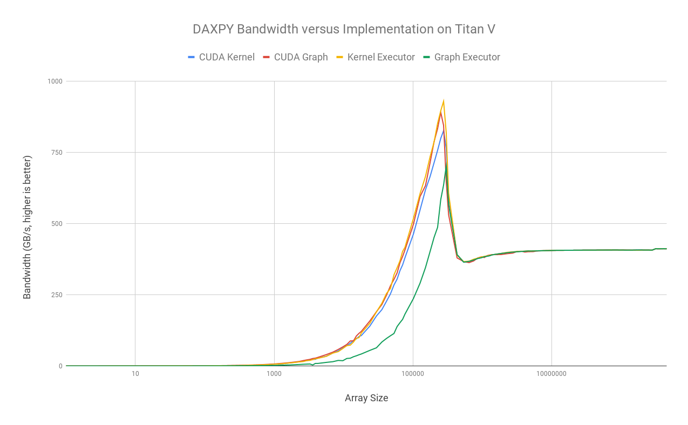

# QMCPACK ECP Deliverable 3

Author: Jared Hoberock jhoberock@nvidia.com

# Executive Summary

This report assesses the effectiveness of the initial C++ executor prototypes
delivered in Milestone 2 of ECP subcontract (4000164981). It demonstrates that
the future-looking programming model represented by executors does not
introduce a signficant performance penalty for a memory bandwidth-bound
computational kernel (DAXPY) on large problem sizes. Finally, we identify
avenues for improving the performance of our executor prototypes for small
problem sizes.

# Introduction

Deliverable 2 of the QMCPACK ECP subcontract with NVIDIA is an initial
C++-based prototype of a future-looking programming model that provides
abstractions built around a CUDA Graphs-compatible infrastructure for optimized
execution. *Executors* were chosen as the programmer-facing interface of this
programming model, because executors are expected to arrive in a future C++
standard and become a ubiquitous interface for creating execution in C++
programs. Executors present the programmer with a regular and uniform interface
for creating execution which hides idiosyncratic and platform-specific work
creation mechanisms. Because programming abstractions sometimes result in a
trade-off between efficiency and convenience, it is important to demonstrate
that the executor prototypes delivered in Milestone 2 are not likely to result
in performance penalties in QMCPACK.

# Methodology

We are interested in demonstrating that the efficiency of our executor
prototypes is equivalent to the lower-level work creation mechanisms they
abstract. For our purposes, there are two lower-level work creation mechanisms
of interest:

  1. CUDA kernels launched through the CUDA C++ "triple chevrons", and
  2. CUDA kernels launched through the CUDA Graphs API.

Milestone 2 delivered two executor prototypes abstracting these mechanisms:
`kernel_executor` and `graph_executor`, respectively.

To evaluate the efficiency of these executors, we chose to measure the achieved
bandwidth of a simple vector addition kernel, DAXPY. Executors abstract the
manner in which such a kernel is launched, but do not intrude upon the body of
the kernel itself. Therefore, any performance overhead introduced by an
executor will be incurred as part of the cost of launching the kernel.

We implemented the DAXPY kernel using four implementation strategies:

  1. as a CUDA kernel launched through the triple chevrons,
  2. as a CUDA Graph,
  3. via `kernel_executor`, and
  4. via `graph_executor`.

Each CUDA thread created by each of these strategies performs a single
element-wise addition. Across a range of data set sizes, we measured the
performance of each of these strategies by measuring the time spent executing
one hundred evaluations of the kernel. Any time spent initializing resources
was not included in this measurement.  Our experiments were executed on a Titan
V GPU.

# Results

The following chart summarizes the efficiency of each implementation strategy.

For large problem sizes, each implementation strategy performs identically,
with achieved memory bandwidth plateauing around 411 GB/s. However, for
small problem sizes, the `graph_executor` is relatively inefficient until
the array size grows to 300K elements. This is because the prototype's
implementation conflates task submission with CUDA Graph creation and
instantiation. Currently, CUDA Graph instantiation is significantly more
expensive than CUDA kernel launch overhead, and this overhead dominates
the performance of small kernels.

# Future Work

In order to be relevant to small kernels, the performance of our current
`graph_executor` prototype must be accelerated by eliminating the cost of
redundant graph instantiations. Fortunately, we expect this task to be
straightforward. At least two approaches are possible: 1. by separating the act
of creating and instantiating the underlying CUDA Graph or 2. by internally
retaining the result of the initial instantiation. Either approach is viable,
but each may have different ramifications on the programmer-facing
executor interface.  We expect the experience gained through future
project milestones to guide our approach.

